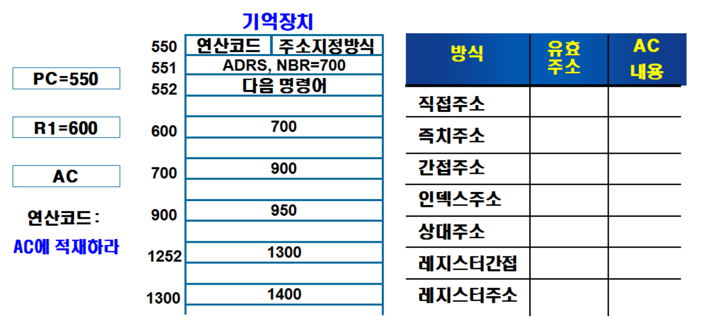

# 유효주소와 AC에 적재되는 값

|   방식    |   유효주소    |   AC 내용    |
|----------|-------------|-------------|
|   직접주소    |   700    |   900    |
|   즉치주소    |   551    |   700    |
|   간접주소    |   900    |   950    |
|   인덱스주소    |   700+600=1300    |   1400    |
|   상대주소    |   700+552=1252    |   1300    |
|   레지스터 간접    |   600    |   700    |
|   레지스터 주소    |   x    |   600    |

명령어의 연산코드 필드는 수행 명령어 종류를 지정하며, 이 명령어는 기억장치 혹은 컴퓨터 레지스터에 저장된 항목을 대상으로 수행이 됩니다. 프로그램을 수행할 때 오퍼랜드를 지정하는 방식은 명령어 내에 있는 주소지정방식에 의해서 결정이 되는데, 이 주소지정방식에 의해 만들어진 오퍼랜드 주소를 유효주소라고 합니다.

먼저 주어진 그림을 살펴보겠습니다. 주소 550과 551에는 주소영역 ADRS 혹은 오퍼랜드 NBR이 700인 명령어 LDA(AC에 적재하라)가 들어 있습니다. PC(Program Counter)는 해당 주소인 550을 기억하고 있는 상태이며, 레지스터 R1에는 400이 저장되어 있습니다. AC는 실행된 결과값이 저장되는 곳으로 준비되어 있습니다.

명령어가 실행되기 위해, PC가 가리키는 기억장치로부터 2개의 워드를 읽어와 제어 레지스터로 옮기고 PC의 값을 2 증가시켜 줍니다. 명령 수행 후 PC는 다음 명령어 주소인 552를 가지게 된 상태입니다.

직접주소 지정방식은 명령어 주소 필드에 직접 오퍼랜드의 주소를 저장하는 방식입니다. ADRS는 700이고, 주소값 700 (M[ADRS])에 들어 있는 값은 900이므로, AC에 적재된 값은 900입니다.

즉치주소 지정방식은 오퍼랜드 필드가 곧 데이터입니다. 즉, PC가 읽어온 값인 오퍼랜드 500이 AC로 적재됩니다. 이때 유효주소는 해당 값을 읽어온 주소인 551이 됩니다.

간접주소 지정방식은 명령어의 주소 필드에 유효주소가 저장되어 있는 기억장치주소를 기억시키는 방식입니다. 유효주소가 저장되어 있는 기억장치주소는 M[ADRS]인 700이며, 여기에 저장된 값인 900이 유효주소가 됩니다. 따라서, AC에 로드되는 기억장치 900번지에 저장되어 있는 950이 됩니다.

인덱스된 주소지정방식은 인덱스 레지스터 내용을 명령어 주소 부분에 더해 유효주소를 얻습니다. R1 레지스터를 인덱스 레지스터라 생각하겠습니다. 명령어 주소 부분의 내용인 700에 R1 레지스터, 즉 인덱스 레지스터의 내용(600)을 더한 값인 1300이 유효주소가 됩니다. AC에 적재된 값은 1400이 됩니다.

상대주소 지정방식은 특정 레지스터 내용에 명령어 오퍼랜드값을 더하는 방식입니다. 분기 주소가 명령어 워드와 가까운 위치에 있는 경우, 분기형 명령어에서 종종 사용한다고 합니다. 유효 주소는 명령어 주소부분의 내용(700)에 PC의 내용(552)를 더한 값인 1252가 됩니다. AC에 적재된 값은 1300입니다.

레지스터 간접 주소지정 방식과 레지스터 주소지정 방식은 각각 레지스터의 실제 내용이 기억장치주소의 값이 들어있거나 피연산자가 들어있습니다. 레지스터 간접방식은 유효주소가 R1, 즉 600이고, AC에 적재된 값은 700입니다. 레지스터 주소방식은 오퍼랜드를 R1값이 지정하고 있어 오퍼랜드 600이 AC에 적재됩니다. 이때 레지스터의 주소는 없기 때문에 유효주소는 따로 존재하지 않습니다.
