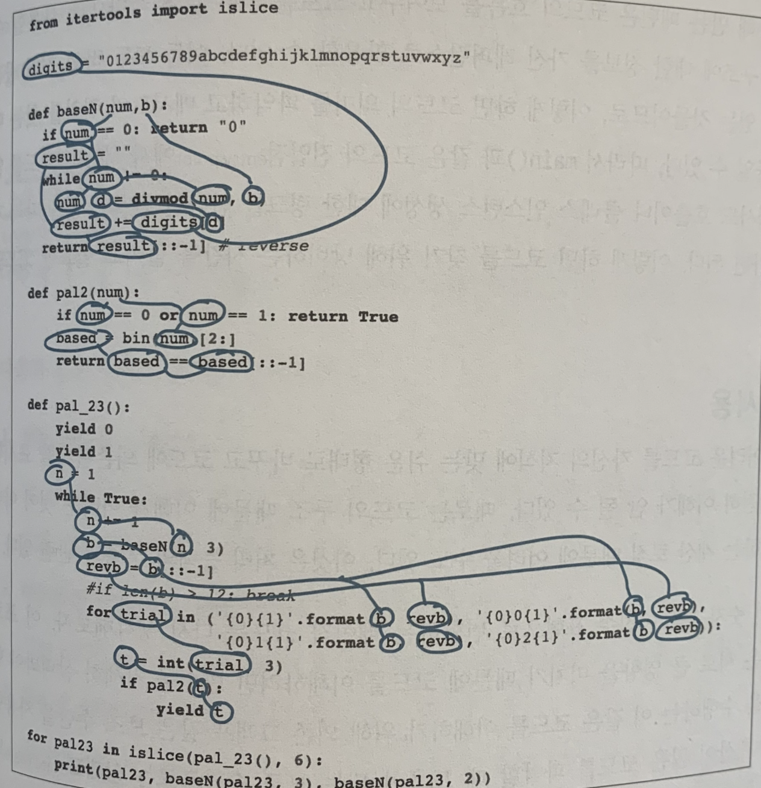
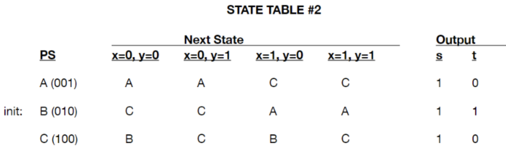

# 프로그래머의 뇌

저자 펠리너 헤르만스

인지과학에 기반을 둔 방법론을 소개해서, 개발자가 빠르게 학습하고 생산성을 높이는 방향을 제안해줍니다.

총 4개 파트, 13개 챕터로 이뤄져있는데, 이 중 **Part 1. 코드 더 잘 읽기**를 소개하려고 합니다.

---

## ch 1. 코딩 중 겪는 혼란에 대해 이해

1. 지식 부족
    - 예) 프로그래밍 언어 APL로 씌여진 코드를 이해할 수 없다.
        
        ```jsx
        2 2 2 2 T n
        ```
        
    - 프로그래밍 언어, 알고리즘, 업무영역 등 지식이 없는 경우
2. 쉽게 찾을 수 있는 정보의 부족
    - 예) 특정 메서드 `toBinaryString` 가 어떻게 동작하는지 모른다. 이름으로 유추할 수는 있겠지만, 구체적으로 어떤 일을 수행하는지 이해하지 못한다.
        
        ```
        public class BinaryCalculator {
        	public static void mian(Integer n) {
        		System.out.println(Integer.toBinaryString(n));
        	}
        }
        ```
        
    - 코드가 다양한 라이브러리, 모듈, 패키지 등을 사용하고 있는데, 이 정보를 얻기 위해 잘 찾아보고 찾아보기 전에 무얼 하고 있었는지도 기억해야 한다.
        - 함수가 어떤 일을 하는지 파악했더라도, 하루 혹은 한 시간 지나기 전에 잊어버릴 수 있다.
3. 두뇌의 처리 능력 부족
    - 긴 코드를 따라가다보면 머릿속에서 모든 과정을 처리하기 어렵다. 코드 각각의 단계가 실행되는 것을 파악하기가 어려워서, 변수가 어떤 값을 가지는지 주석을 달아놔야 할 때도 있다.
        
        ```jsx
        function a(b) {var c = 1;var d = b.length ;var n = new Array();
        for(var i=0; i<d; i++){n[b[i][1]] = n[b[i][1]]?n[b[i][1]]+1:1;}
        for(var i in n){c*=n[i]+1;}return c-1;
        }
        print(a([["crowmask", "face"], ["bluesunglasses", "face"], ["smoky_makeup", "face"]]))
        ```
        

- 지식 부족 → **장기 기억 공간 (long-term memory, LTM)**의 문제
- 지식이 아니라 특정 정보가 부족 → **단기 기억 공간 (short-term memory, STM)**의 문제
- 처리 능력의 부족 → **작업 기억 공간 (working memory)** 의 문제

**LTM**

- 하드 드라이브 같은 역할
    - 다른 코드를 참고하지 않고 JS의 클래스를 작성할 수 있다

**STM**

- 들어온 정보를 잠시 보관할 때 사용
- 크기 제한이 있어, 최대치가 12개를 넘지 않음
- 코드에서 키워드, 변수명, 자료구조 등이 STM에 일시적으로 저장
- 정보 수집 시 단기기억장소에 일시적으로 저장하지만, 다른 정보를 찾는 과정에서 이미 수집해놓은 정보 중 일부는 잊어버린다.
- 메인 메모리, 캐시 같은 역할
    - 코드를 읽어 내려가면서 각각 변수와 메서드가 하는 역할을 잠깐 기억해둔다
    - array의 reduce 메서드 사용법이 기억나지 않아 MDN에서 찾아본다

**작업 기억 공간**

- 생각, 아이디어, 해결책 같이 실제 사고 작용은 작업 기억 공간에서 일어난다.
- 코드를 실행해보면서 무슨 일이 일어날지 이해하려고 시도한다. 머릿속에서 코드를 컴파일하고 실행하는데, 이때 과부하 상태가 오면 값을 코드에 적어놓고 싶은 생각이 들 수 있다.
- 두뇌의 프로세서
    - for 문이 계속 실행될 때 일어나는 연산을 수행한다

### 인지 과정들의 장호 작용

- 사고할 때 LTM, STM, 작업 기억 공간 세 가지 인지 과정이 모두 어느 정도 활성화된다.
    - 예) Java 코드에서 n이라는 변수가 정수형이라는 정보는 STM에 저장되고, 정수라는 것이 무엇인지에 대한 정보는 LTM에서 인출한다. 해당 코드가 무슨 역할을 할지 파악하는 일은 작업 기억 공간에서 일어난다.

---

## ch 2. 신속한 코드 분석

- 프로그래머의 시간 중 60%는 코드를 작성하는 것이 아니라 ‘이해’하는 데 사용한다고 한다.
- 코드를 빨리 이해한다면 **프로그래밍 기술이 향상**되는 것이다.

### **기억의 크기 제한을 극복하기**

- STM은 2~6개 사이의 항목을 저장할 수 있는 용량을 가능 ⇒ STM이 최대 6개까지만 기억할 수 있다면, 인간은 제한된 기억력으로 어떻게 많은 다른 일들을 하는 것일까?
- 정보를 기억할 때 STM은 크기에 대한 제약을 극복하기 위해 LTM과 협업한다
    - 단어, 코드 등 정보 분석 시 LTM과 STM 사이에 상호작용이 일어난다

- 5초 동안 아래 문장 기억하기
    
    abk mrtpi gbar
    
- 마찬가지로 5초 동안 아래 문장 기억해보기
    
    cat loves cake
    

- 단위(chunk)로 묶기
    - STM 기억 공간을 하나만 차지한다

- LTM에 지식이 부족하면 코드를 읽을 때 하위 수준의 정보들 (ex. 문자, 키워드…) 에 의존해야 한다. 이때 STM 공간이 빠르게 소진된다.
    - LTM이 코드와 관련 있는 지식을 충분히 가지고 있다면 코드의 하위 수준 요소들을 STM에 저장하는 대신, `자바에서의 for loop`, `파이썬으로 된 선택정렬 알고리즘` 같은 식으로 추상 개념을 기억한다.
        
        ⇒ **STM의 공간이 절약**된다.
        
- ALGOL 언어의 키워드 21개를 외워보기
    
    ```
    STRING CASE OR NULL ELSE STEP DO
    FOR WHILE TRUE IS REAL THEN OF
    FALSE BITS LONG AND SHORT IF END
    ```
    
- 초급 개발자의 방식
    
    `TRUE IS REAL THEN FALSE`
    
    기억하기 좋게 문장으로 만든다
    
- 숙련 개발자의 방식
    
    `TRUE FALSE IF THEN ELSE`
    
    이미 가지고 있는 지식을 사용해서 키워드를 묶는다
    

### 읽기 쉬운 코드 작성하기

코드는 우리 두뇌에서 처리하기 쉽게 만드는 특징들 (ex. 디자인 패턴, 주석문, 명확한 표식 등) 을 가진다.

1. **디자인 패턴**
    - 디자인 패턴을 교육받은 후 코드를 수정할 때는 디자인 패턴이 적용된 코드에 대해서는 수정 시간이 줄어들었고, 그렇지 않은 코드는 크게 차이가 없었다.
    - 디자인 패턴을 사용하면 청킹 능력이 향상된다는 것을 알 수 있다.
2. **주석문 쓰기**
    - 코드가 주석문을 포함하고 있으면 개발자가 코드를 읽는 시간이 더 많이 들어간다.
        - 개발자들이 코드를 읽을 때 주석문 역시 읽는다!
        - 주석문을 작성하는 것이 전혀 의미 없는 일은 아니다.
    - 코드에 주석문이 있으면 새로운 팀원이 코드를 쉽게 이해할 수 있다.
    - 개발자가 코드를 청킹하는 방식에도 영향을 미친다.
    - 다만 저수준 주석문 (i++; 에 i를 1만큼 증가) 은 오히려 청킹 작업에 부담을 준다.
3. **표식 남기기**
    - 코드 내에서 사용하는 특정 자료구조, 알고리즘 또는 접근방식을 보여주는 라인을 뜻한다.
    - 숙련된 개발자는 코드를 읽고 이해하는 데 표식을 많이 이용하는데, 초급 개발자는 그렇지 않다.
    
    ```python
    # **트리**에서 한 노드를 나타내는 클래스
    
    class Node:
    	def __int__(self, key):
    		**self.left** = None
    		**self.right** = None
    		self.val = key
    
    # 중위 순회 함수
    
    def print_in_order(root):
    	if **root**:
    		# 왼쪽 자식에 대한 첫 번째 재귀 호출
    		print_in_order(root.left)
    		# 노드 데이터 출력
    		print(root.val)
    		# 오른쪽 자식에 대한 재귀 호출
    		print_in_order(root.right)
    
    print("트리의 내용은 다음과 같다")
    print_in_order(**tree**)
    ```
    
    - 이진트리임을 알려주는 표식들
        - 주석문에 단어 ’트리’를 사용
        - root와 tree라는 변수명
        - left와 right라는 필드명
        - 트리에 관한 문자열 값 (“트리의 내용은 다음과 같다”)

### 청킹 연습

의도적 연습을 해보자! 

- 의도적 연습이란, 어떤 기술을 향상시키기 위해 조금씩 노력하고 적극적으로 개선해 나가는 것을 의미

1. 어느 정도 익숙한 코드를 선정
2. 최대 2분 동안 코드 파악
3. 종이 혹은 IDE에서 코드를 보지 않고 재현
4. 회고
    - 내용
        1. 어느 부분을 쉽게 기억했는가
        2. 부분적으로 기억한 코드가 있는가
        3. 전체를 다 기억하지 못한 코드가 있는가
        4. 기억하지 못한 라인들이 있다면 그 이유가 무엇일까
        5. 기억하지 못한 라인엔 본인이 익숙하지 않은 프로그래밍 개념이 들어있지는 않은가
        6. 기억하지 못한 라인에 본인이 익숙하지 않은 도메인 지식이 들어있지는 않은가
5. 다른 사람과 비교 (생략 가능)

- 예시로 가져온 코드 (ad-dashboard)
    
    ```jsx
    const KEY_BY_GENDER = {
      M: '남성',
      F: '여성',
      NA: '알수 없음',
    };
    
    const toggleData = (props, gender) => {
      const { target_gender, onUpdate } = props;
      target_gender[gender] = !target_gender[gender];
      onUpdate(target_gender);
    };
    
    const drawRow = (props, gender) => {
      const { user, target_gender } = props;
      const other_gender = gender === 'F' ? 'M' : 'F';
      return (
        <div>
          { gender !== 'NA' ?
            (<label>
              <input type="checkbox"
                checked={!!target_gender[gender]}
                disabled={!target_gender[other_gender]}
                onClick={() => toggleData(props, gender)}
              /> { KEY_BY_GENDER[gender] }
            </label>) :
            user.user_id === 'DABLE' ?
              (<label>
                <input type="checkbox"
                  checked={!!target_gender[gender]}
                  disabled={!target_gender['M'] && !target_gender['F']}
                  onClick={() => toggleData(props, gender)}
                /> { KEY_BY_GENDER[gender] }
              </label>) : null }
        </div>
      );
    };
    
    export default (props) => {
      return (
        <div>
          { drawRow(props, 'M') }
          { drawRow(props, 'F') }
          { drawRow(props, 'NA') }
        </div>
      );
    };
    ```
    

---

## ch 3. 프로그래밍 문법 빠르게 배우기

- Date 객체를 사용해 day-month-year 순서로 된 포맷 만들기
- s 또는 season으로 시작하는 단어와 일치하는 정규식
- splice, split, slice의 차이

많은 개발자들은 프로그래밍 언어 문법을 몰라도 인터넷에 검색하면 된다고 생각해서, 문법에 대한 지식을 중요한 것이 아니라고 여기지만

- 관련 내용을 미리 알고 있으면 코드를 쉽게 단위로 묶어 기억하고 이해할 수 있다
- 두뇌가 작업을 하다 업무가 중단되면 나쁜 영향을 받는다
    - 이메일도 확인하고 뉴스도 검색하고...
    - MDN에서 너무 깊게 다른 주제에 빠지기도 한다
    - 실제로 코딩 중간에 작업이 중단되면 다시 그 업무로 돌아가는 데 15분이 걸린다는 연구결과도 있다

### 플래시카드 사용해 문법 배우기

[https://quizlet.com/](https://quizlet.com/latest)

- 앞면에 개념, 뒷면에 해당하는 코드 적기
- 새로운 프로그래밍 언어나 프레임워크/라이브러리를 익힐 때
- 특정 개념을 검색해볼 때

### 어떻게 하면 잊어버리지 않을 수 있을까

LTM은 추가로 연습하지 않고서는 내용을 오랫동안 기억할 수가 없다

→ 한 시간 이내 우리가 알고 있는 것의 반을 잊어버리고, 이틀 후에는 배운 것의 25%만 남는다

- 반복학습 시 간격 연구
    - 독일어 단어를 50개씩 6개 그룹으로 나누고, 각각 서로 다른 학습 간격 (2주, 4주, 8주) 및 반복 횟수 (13회, 26회) 를 두었다.
    - 그리고 나서 1년, 2년, 3년, 5년이 지난 후 얼마나 기억하는지를 확인해봤다.
    - 결과
        
        학습 기간이 끝난 후 1년이 지나, 가장 긴 간격인 8주의 간격을 두고 26회 반복한 경우 가장 많은 단어를 기억 (76%) 한다는 것을 확인했다.
        
        2주 간격으로 외웠던 그룹은 56%였다.
        

### 문법을 더 오랫동안 기억하기

- 저장강도
    - 무언가를 LTM에 얼마나 잘 저장하고 있는가
        - 4 x 3 = 12
    - 더 많이 학습할수록 내용을 잊어버리는 게 불가능해질 때까지 기억은 강해진다
- 인출강도
    - 무언가 얼마나 쉽게 기억할 수 있는지
        - 잘 알고 있다고 확신하는 JS filter 함수 문법이 막상 기억 안나는 경험
- 저장 강도는 감소하지 않고 늘지만, 인출 강도는 시간이 흐륵수록 약해진다.
- 정보를 반복 학습하면 저장 강도는 강화되는데, 이미 알고 있는 것을 기억하려고 노력하면 추가 학습 없이도 인출 강도가 강화된다.

⇒ 이전에 여러 번 본 코드라도 해도, 단지 보기만 하는 것으로는 나중에 그 코드를 기억할 수가 없다.

**정보를 기억하는 것은 기억을 강화한다**

- 학생들에게 16행의 시를 외우게 시키고 시험을 본 뒤, 이틀 후 시험이 있다는 것을 몰라 공부를 하지 않은 채로 2, 3차 테스트를 봤다.
    - 1차 테스트보다 2차, 2차보다 3차 테스트에서 평균적으로 10%를 더 기억했다.
    - 학습을 추가로 하지 않고 정보를 기억하려고 능동적으로 노력하는 것만으로도 더 많은 것을 기억할 수 있다.
- 문법을 기억하려고 애쓰는 것만으로도 인출 강도가 강해지고 더 많이 기억할 수 있게 된다.

⇒ 구글링 하기 전, 능동적이고 의도적으로 기억하려고 애쓰고 시도해 본다. 

⇒ 그래도 기억이 안난다면 플래시 카드를 사용해서 적극적으로 연습해 보자!

---

## ch 4. 복잡한 코드 읽는 방법

### 복잡한 코드를 이해하는 것이 왜 어려울까

**작업기억공간과 STM의 차이**

- STM은 정보를 기억하는 역할
    - 전화번호를 외우는 것 (542-121-851) -> STM
- 작업 기억 공간은 정보를 처리하는 역할로, ‘문제에 적용된 STM’이라는 의미로 볼 수 있다.
    - 숫자를 더하는 일 (542+121+851) -> 작업기억공간
- 작업기억공간은 STM처럼 한번에 2~6개까지만 기억할 수 있다. (인지 부하)
- 너무 많은 요소가 있어 청크로 나뉘지 않는 문제를 풀 때 작업기억공간은 과부하 상태가 된다.

**프로그래밍과 관련한 인지 부하 종류**

- 내재적 부하: 문제 자체가 얼마나 복잡한지
    - ex) 10 이상인 요소만 새로운 배열에 저장한다
- 외재적 부하: 외부적 요인에 의해 문제에 추가된 것. 문제가 실제로 어려워진 것은 아니지만 추가적인 작업이 생긴다.
    - ex) python의 리스트 컴프리헨션을 모르는 사람은 첫 번째 코드에 대한 외재적 부하가 다른 사람에 비해 더 크다.
    
    ```
    above_ten = [a for a in items if a > 10]
    
    above_ten = []
    for a in items:
    	if a > 10: above_ten.append(a)
    ```
    
- 본유적 부하: 생각을 LTM에 저장하는 과정에서 일어나는 인지부하

### 인지 부하를 줄이기 위한 기법

**리팩터링**

- 대개 코드 유지보수를 쉽게 하기 위한 목적으로 이뤄지지만, 반드시 가독성까지 좋아진다고 볼 수는 없다.
    - 여기저기서 사용되는 메서드를 리팩토링 해서 중복을 줄였을 때, 이 메서드를 이해하기 위해 파일을 왔다갔다 해야 한다. (delocalized code)
- 인지적 리팩터링
    - 코드가 외부로 제공하는 기능을 변경하지는 않는다. 유지보수하기 좋은 코드가 아니라 현 시점에서 개발자가 읽기 쉬운 코드로 변경한다.
        - 메서드를 인라인으로 구현
        - 일반적인 메서드 이름을 구체적으로 변경
        - 메서드를 호출하는 위치에 가깝게 정의하는 등 메서드 순서를 바꿈
    - 인지적 리팩터링은 개발자 자신만을 위한 리팩터링이다.
- 코드를 일단 이해하고 나면 원래 상태로 되돌릴 수 있다.

**생소한 언어 구성 요소를 다른 것으로 대치하기**

1. 리스트 컴프리헨션

```
customer_names = [c.first_name for c in customers if c.age > 50]

customer_names = []
for c in customers:
	if c.age > 50:
		customer_names.append(c.first_name)
```

1. 삼항연산자
    - 연산이 한 라인에서 이루어진다는 점이나, 인수의 순서가 다른 전통적인 if 문과는 달라서 외재적 인지 부하가 과도하게 일어날 수 있다.

```
isMember ? '$2.00' : '$10.00' // js
'$2.00' if is_member else '$10.00' // python
```

위에서 설명한 리팩토링이 이상하거나 잘못된 것처럼 보일 수 있지만, 무엇이 읽기 쉬운지는 이미 가지고 있는 지식에 따라 다르므로 좀 더 친숙한 형태로 바꾸어 이해하는 것은 부끄러운 일이 아니다.

### 작업 기억 공간에 부하가 오면 사용할 수 있는 기억 보조 수단

- 리팩터링을 해도 코드 구조가 복잡하다면, 여전히 작업 기억 공간에 과부하를 줄 수 있다.
    1. 정확히 코드의 어디를 파악해야 하는지 모를 때
        - 필요 이상으로 많은 코드를 읽게 되고, 작업 기억 공간이 처리하는 것보다 더 많은 양을 이해해야 하는 상황이 될 수 있다.
    2. 코드가 서로 밀접하게 연결되어 있을 때
        - 두뇌는 코드 개별 라인을 이해하면서
        - 한편으로 어떤 부분을 계속 읽어야 하는지 판단하고자 코드 구조를 이해해야 한다

⇒ 코드를 여러 번 연속해서 읽어도 이해가 되지 않는다면, 작업 기억 공간이 한계에 다다른 것일 수 있다.

### **의존 그래프 생성**

코드를 프린트하거나 PDF 파일로 변환해서 태블릿으로 열고 주석을 달면 좋다.

1. 모든 변수를 원으로 표시
2. 비슷한 변수를 연결
3. 모든 메서드나 함수 호출을 원으로 표시
4. 메서드나 함수 호출을 정의와 연결
5. 클래스의 모든 인스턴스를 원으로 표시
6. 클래스와 그 클래스의 인스턴스를 연결



⇒ 코드 흐름을 보여주고, 코드를 읽는 보조수단으로 사용할 수 있다

⇒ 코드 구조에 대한 정보를 가진 레퍼런스로 활용할 수 있다

### **상태표 사용**

코드에서 수행하는 계산 로직 자체가 어려운 경우 상태표를 사용한다.



상태표는 코드 구조보다, 변수의 값에 중점을 둔다. 테이블 열은 변수, 행은 해당 변수에서 각 단계가 가지는 값을 나타낸다.

```jsx
let x = '3'
let num = Number(x)
let state = 1
for (let i = 0; i < num; i++) {
	const k = num * 3
	state += k
}
```

모든 변수를 나열

1. 테이블을 만들고 각 열에 하나의 변수를 기입
2. 코드의 실행 단계마다 행을 만든다
3. 코드를 각 단계별로 실행하고 그 단계에서 변수들의 값을 해당하는 열과 행에 적는다
    - 상태표를 자세하게 작성하면 좋다

|  | x | num | state | k |
| --- | --- | --- | --- | --- |
| init | ‘3’ | 3 | 0 | - |
| loop 1 |  |  | 10 | 9 |
| loop 2 |  |  | 19 | 9 |
| loop 3 |  |  | 28 | 9 |

- 의존 그래프와 상태표를 혼용한 연습문제
    
    가능하다면 변수명이나 로직 등도 리팩터링 해보는 것도 좋겠다!
    
    ```jsx
    let chars = ['a', 'b', 'c', 'd']
    let calculate = (a, k, f) => {
    	let n = a.length
      if (k < 1 || k > n) {
        throw new Error('forbidden')
      }
      let indexes = new Array(4).fill(0)
      let total = Math.pow(n, k)
    
      while(total-- > 0) {
        let x = ''
        for (let i = 0; i < n - (n - k); i++) {
          x += a[indexes[i]]
        }
        console.log(x)
    
        if (f(indexes)) break;
    
        for (let i = 0; i < n; i++) {
          if (indexes[i] >= n - 1) {
            indexes[i] = 0
          } else {
            indexes[i]++
            break
          }
        }
      }
    }
    
    // console에 찍히는 bba를 찾는다
    calculate(chars, 3, i => i[0] === 1 && i[1] === 1 && i[2] === 0)
    
    ```
    
    |  | n | indexes | total | x |
    | --- | --- | --- | --- | --- |
    | init |  |  |  |  |
    | while 1 |  |  |  |  |
    | for 1 |  |  |  |  |
    | for 2 |  |  |  |  |
    | for 3 |  |  |  |  |
    | for 4 |  |  |  |  |
    | while 2 |  |  |  |  |
    | while 3 |  |  |  |  |
    | while 4 |  |  |  |  |
    | while 5 |  |  |  |  |