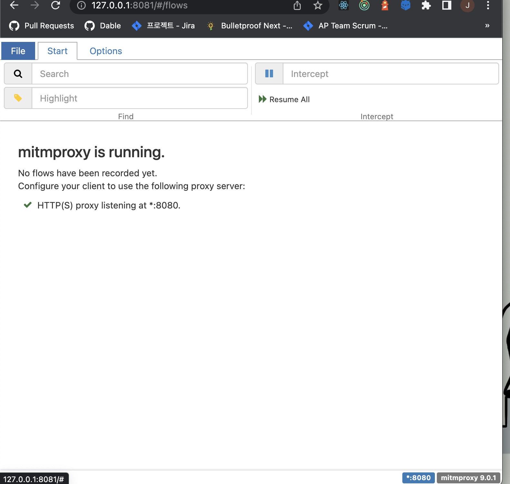
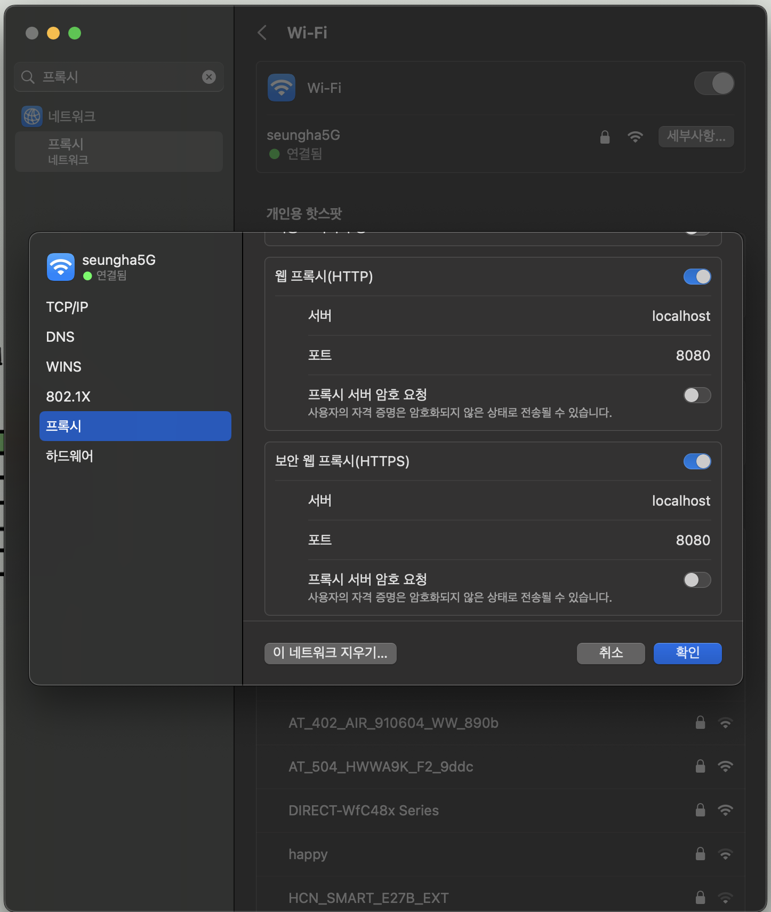
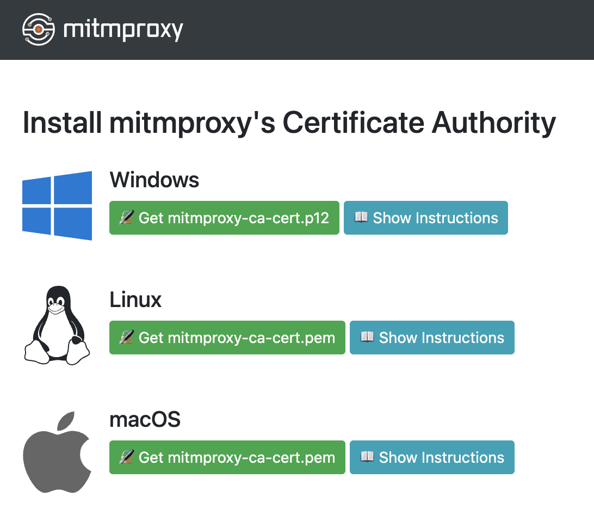
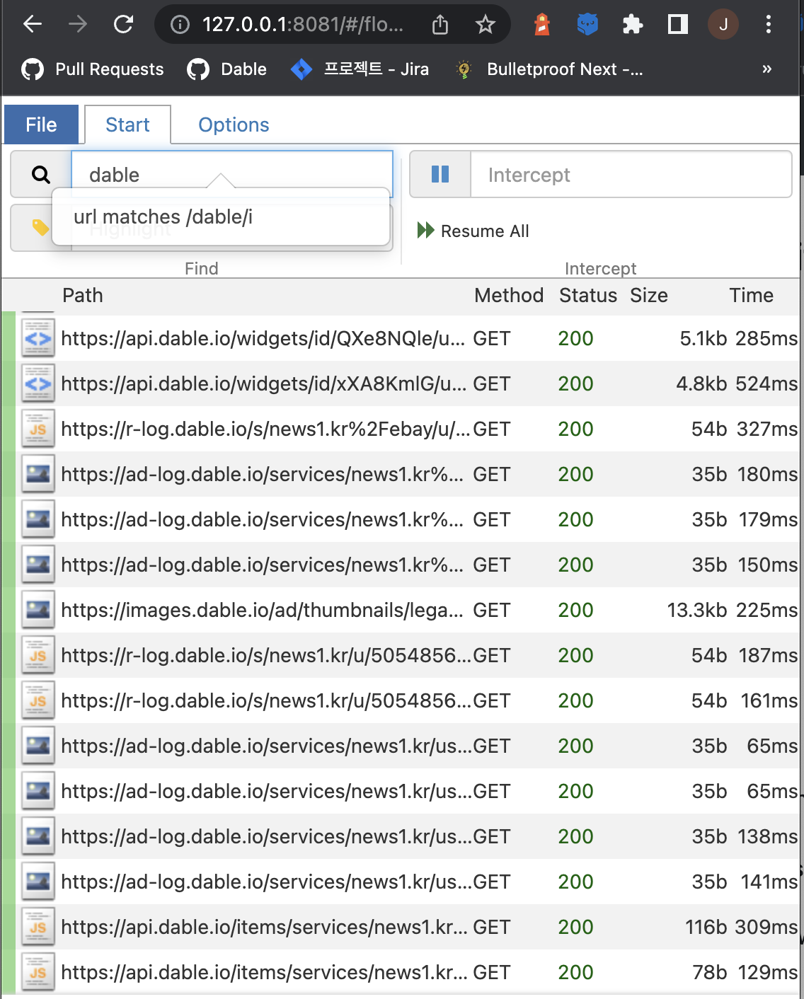
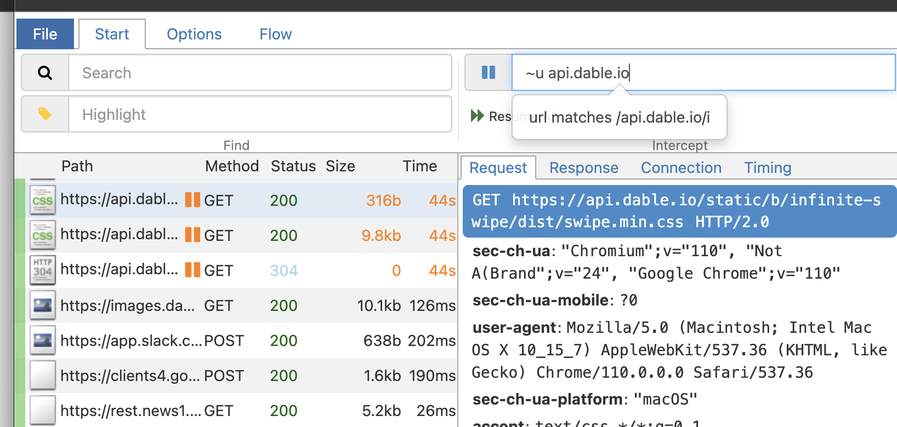
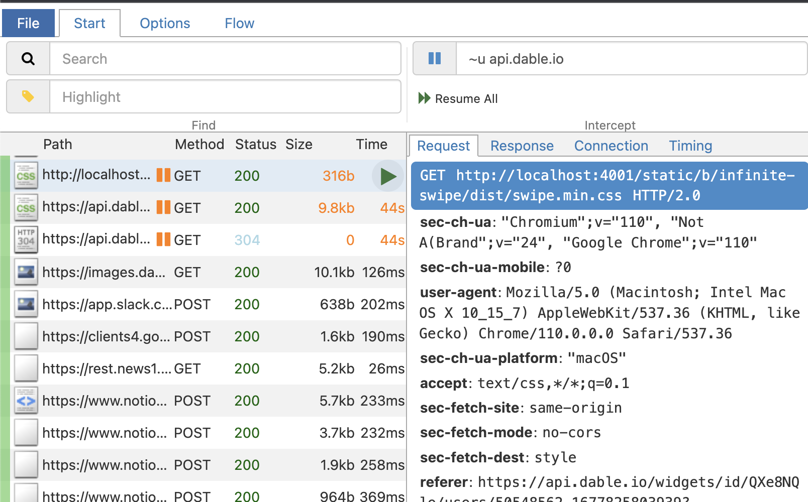
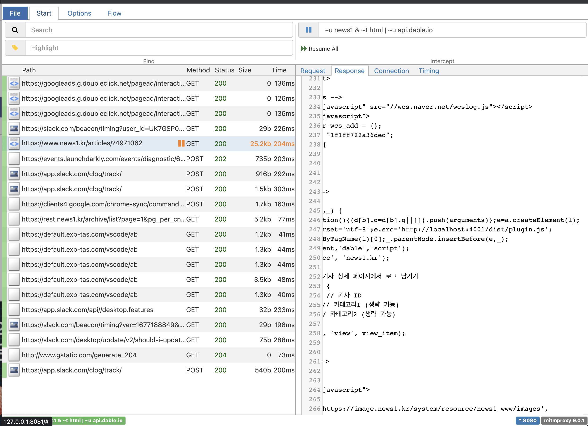
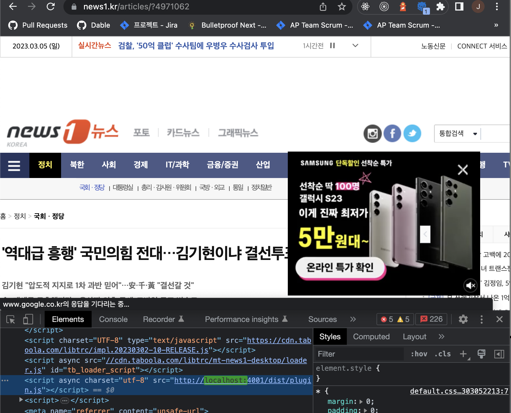

# reco-api 디버깅 쉽게 하기: mitmproxy

mitmproxy는 HTTP/HTTPS 요청을 살펴보고 필요에 따라 조작도 가능하게 해주는 도구입니다. 여기서 mitm은 “Man in the middle”(중간자 공격)의 약어로 원래는 보안 공격의 한 형태를 의미하는데 이 도구가 하는 역할도 해당 공격과 동일합니다.

사용자가 서버로 보낸 요청을 중간에서 가로채고 마치 해당 서버가 응답을 한 것처럼 사용자에게 변조된 데이터를 돌려줍니다. 다만, 이 경우에는 사용자인 우리가 인지하고 있으므로 잘 활용하기만 하면 도움이 될 것입니다.

- HTTP/HTTPS 요청과 응답 가로채고 그 자리에서 수정
- 추후 재실행 및 분석용으로 전체 네트워크 요청/응답 저장
- HTTP 요청/응답을 client-side 및 sever-side에서 재실행
- Python으로 스크립트 작성
- 지정된 서버로 트래픽을 전달하는 리버스 프록시 모드

---

## mitmproxy 설치 및 설정

1. `mitmproxy` 설치
    
    ```bash
    brew install mitmproxy
    ```
    
2. `mitmweb` 실행
    
    ```bash
    mitmweb	
    ```
    
    1. 브라우저에 mitmweb [http://127.0.0.1:8081/](http://127.0.0.1:8081/) 실행되는 것 확인하기
        
        
        
    2. mitmweb은 브라우저 UI 형태로 제공되며 아직 베타이긴 하지만, 쓰기 편해서 추천. mitmproxy CLI로도 사용 가능.
3. [브라우저 프록시 서버 설정](https://docs.mitmproxy.org/stable/overview-getting-started/#configure-your-browser-or-device)
    1. 설정 - Wi-Fi - 연결된 wifi 세부사항 - 프록시
    2. 웹 브라우저에서 디버깅하는 경우
        1. 웹 프록시(HTTP) 및 보안 웹 프록시(HTTPS) 켜고 [localhost:8080](http://localhost:8080) 설정 - 확인 - 적용
    3. iOS 등 별도의 기기로 디버깅하는 경우
        1. [https://blog.outsider.ne.kr/1514](https://blog.outsider.ne.kr/1514) 참고 (같은 네트워크 연결 후 로컬 IP 주소 확인해서 설정하기)
    
    
    
4. [HTTPS 연결을 위해 인증서(certificate) 추가](https://docs.mitmproxy.org/stable/concepts-certificates/)
    1. [http://mitm.it/](http://mitm.it/) 접속
    2. 프록시 설정이 잘 되었다면, certificate를 다운로드 받을 수 있는 링크 확인 가능
        
        
        
        1. pem 파일 다운로드 후, 실행
        2. Keychain Access 실행되면 목록에서 mitmproxy를 검색하고, 해당 certificate를 ‘항상 신뢰할 수 있음’으로 체크 (비밀번호 입력 필요)
    3. 프록시 설정이 되지 않았다면 아래와 같은 창이 뜨게 됨 → 프록시 설정이 제대로 되었는지 확인하자
        
        
        
5. 이제부터 접속하는 모든 네트워크 요청이 mitmweb에서 확인 가능
    
    
    

---

## mitmproxy 사용하기 (WIP)

### [요청 인터셉트](https://docs.mitmproxy.org/stable/mitmproxytutorial-interceptrequests/) + [요청 변경](https://docs.mitmproxy.org/stable/mitmproxytutorial-modifyrequests/) + [요청 다시 보내기](https://docs.mitmproxy.org/stable/mitmproxytutorial-replayrequests/)

1. Start 탭의 Intercept(일시정지 칸)에 가로채고 싶은 네트워크를 검색
    1. 참고: [필터 표현식](https://docs.mitmproxy.org/stable/concepts-filters/)
    
    
    
2. 가로챈 네트워크를 변경하고 싶은 요청 URL, 파일, 내용, Response 등 요청을 변경
3. 재생 모양 아이콘 클릭 시 네트워크 재요청 완료
    
    
    
4. Search(돋보기 칸)에서 검색해서 제대로 네트워크가 갔는지 확인하기

### 디버깅 예시

1. static.dable.io의 plugin.min.js → [localhost:4001](http://localhost:4001) 로 띄운 reco-api의 plugin.js로 변경하기
    1. 매체사 사이트의 HTML 파일 intercept: `~u news1 & ~t html` 
    2. HTML 내 데이블 스크립트 호출 부분을 수정(Edit) 및 저장(Done)
    3. 네트워크 재요청
    4. 제대로 요청이 갔는지 확인하기





1. 아이폰에서 네트워크 탭 확인하며 디버깅 하기
    1. [https://blog.outsider.ne.kr/1514](https://blog.outsider.ne.kr/1514) 참고
2. 특정 네트워크 에러 때문에 데이블 전환 스크립트가 실행되지 않을 때 해당 네트워크 인터셉트 후 잘 실행되는지 확인해보기, 특정 SSP 스크립트 파일 수정해서 요청 보내보기…
3. 주의할 점
    1. 화면이 다 그려지고 난 후 [api.dable.io](http://api.dable.io)만 인터셉트 하려고 하면, 원하는 결과가 나오지 않을 수 있음
    2. 스크립트를 호출하는 부분 등을 인터셉트 해서 잠시 멈춰놓고 변경한 후 수정해보는 것을 권장

### python으로 스크립트 작성하기 (WIP)

1. 스크립트를 사용해 자동화 가능 → 우리에게도 쓸모가 있을 듯한데 아직 제대로 보지는 못함 👀 (추후 업데이트 예정)
2. [스크립트 예제](https://docs.mitmproxy.org/stable/addons-examples/)