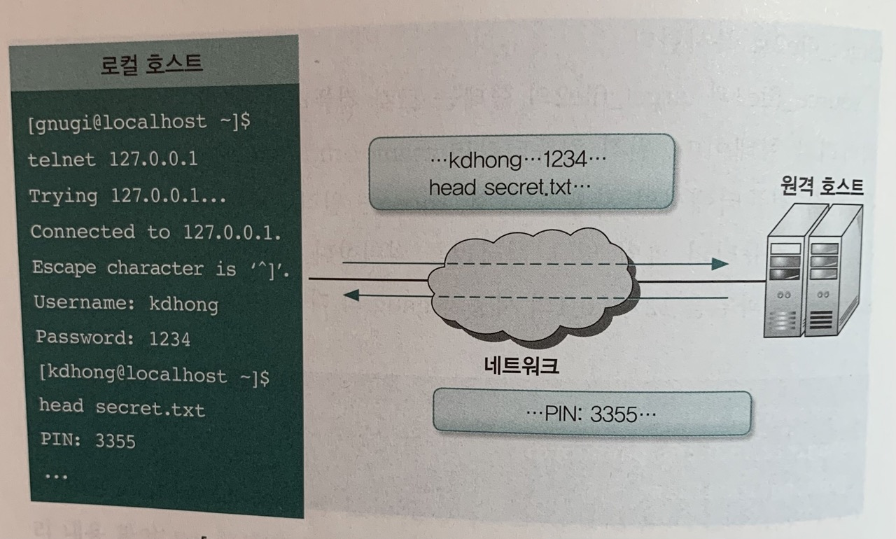
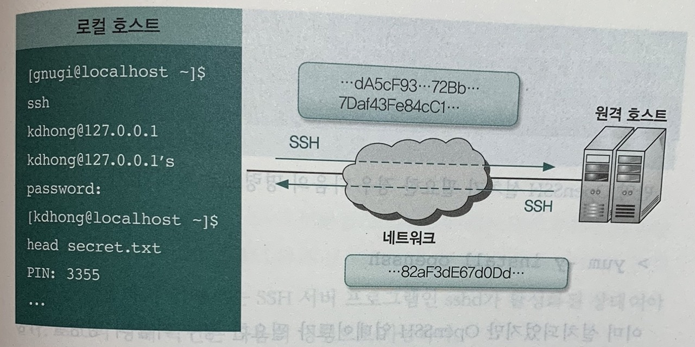

# UNIX 명령어 (4)

## 지난 시간 복습

- 막간 퀴즈
    1. `ssh` 명령어를 설명하는 매뉴얼을 ssh-manual이라는 파일에 저장하고 싶다. 이때 사용해야 하는 명령어는?
        1. `ssh > ssh-manual`
        2. `man ssh > ssh-manual`
        3. `cat ssh >> ssh-manual`
        4. `man ssh | ssh-manual | more`
    2. `~/.zshrc` 의 내용을 수정하고 싶은데, 백업해두고 수정하고 싶습니다. 어떻게 하면 될까요?
    3. 지금까지 입력한 명령어 이력 중, `which` 를 사용한 명령어를 검색하고 싶으면 어떻게 할 수 있을까요?
    4. `lsof` 는 무슨 명령어일까요?
    5. `lsof` 를 실행한 표준 출력 결과물을 페이지 단위로 보고 싶습니다. 어떻게 하면 될까요?
    6. 3000 포트에 프로세스가 켜져 있으면 그 프로세스를 종료하라는 명령어는?
    7. 모든 사용자의 실행 중인 프로세스 중 현재 사용자가 소유한 모든 프로세스를 사용자 친화적으로 자세히 출력하는 명령어는?
    8. 프로세스 중 nginx가 실행 중인지 확인하고, 그 프로세스를 종료하려면?

## 원격 관리

- 네트워크를 통해 원격에서 접속해 다양한 작업 가능
- 전통적인 방법
    - telnet(원격 접속), ftp(원격 파일 접속), rcp(원격 파일 복사)
    - 현재는 대부분 사용하지 않음
        - 주고 받는 모든 명령과 결과 및 접속에 쓰는 계정 정보도 암호화되지 않아 보안상 문제가 있었음
        
        
        
        - 모든 정보가 네트워크 상에서 도청될 수 있음
        - 명령이나 결과 위변조도 가능

### SSH (Secure Shell)

- SSH는 패킷을 암호화하여 전송 → 도청, 위변조 차단
    
    
    
    - 보통 TCP port 번호 22를 사용
    - SSH는 서버/클라이언트 구조로 동작
        - SSH 서버 프로그램 `**sshd**`
            - 데몬 형태로 프로세스가 동작 중이어야 함
                - 데몬(daemon)
                    - 일반 프로세스는 명령어를 실행할 때마다 생성되고, 프로그램을 종료하면 삭제됨
                    - But 항상 동작하는 프로세스도 필요 → 늘 동작하고 있는 프로세스를 데몬이라고 함
                    - 시작부터 셧다운할 때까지 계속 동작
        - Mac에서 sshd를 구동하여 원격 컴퓨터가 접근 가능하도록 하기 → [GUI 이용](https://support.apple.com/ko-kr/guide/mac-help/mchlp1066/mac)
        - Mac에서 sshd가 구동 중인지 확인
            - `sudo launchctl list | grep sshd`
                - `launchctl` : 데몬 등 관리 및 검색
        - UNIX(Linux)에서는…
            - sshd 활성화 하기: `service sshd start`
            - sshd 상태 확인하기: `service sshd status` 혹은 `chkconfig --list sshd`
    - SSH 클라이언트 프로그램: ssh, sftp, scp
        - sftp: 원격 파일 전송
        - scp: 원격 컴퓨터와 서로 파일 복사
    
    ### `ssh` 로 원격 접속하기
    
    - `ssh`
        - SSH를 이용하여 서버에 원격 접속하는 클라이언트 프로그램
        - 접속 시 사용자 계정과 비밀번호를 이용해 로그인
            - 공개키 암호 사용도 가능
                - 암호화/복호화에 사용할 공개키와 비밀키를 생성 → 공개키를 원격 호스트에 복사해 둠
                - 키 생성 명령어 `ssh-keygen`
                - 비밀키는 `~/.ssh/id_rsa` , 공개키는 `~/.ssh/id_rsa.pub` 에 default 저장됨
                - 원격 호스트의 `~/.ssh/authorized_keys` 에 공개키를 추가하면, 공개키 암호 방식으로 인증 가능
                - `ssh -i [비밀키 경로] user@host`
                    - `i` 옵션: identity_file의 약자
        - 직접 컴퓨터에 로그인한 것과 동일하게 이용하는 것이 가능함
    - `ssh [- user] host` 혹은 `ssh user@host`
    - 처음 로그인하는 곳이라면, 호스트 쪽 공개키를 신뢰할지 물어봄
    
    ```bash
    jeesoohong@Jeesoos-MacBook-Pro ~ % ssh jeesoohong@127.0.0.1
    The authenticity of host '127.0.0.1 (127.0.0.1)' can't be established.
    ED25519 key fingerprint is SHA256:gp1piH7kXg9mCo1LrlDzze1I4kKnAMvqHH/y7+47RuM.
    This key is not known by any other names
    Are you sure you want to continue connecting (yes/no/[fingerprint])? yes
    Warning: Permanently added '127.0.0.1' (ED25519) to the list of known hosts.
    (jeesoohong@127.0.0.1) Password:
    ```
    
    - yes를 하게 되면, `~/.ssh/known_hosts` 파일에 정보가 저장됨
        - 원격 호스트명, 암호 종류, 원격 호스트의 공개 키

- 미션 도전!
    - kr-term에 접속해보세요.
        - [Bastion 서버를 통해 AWS 상의 서버에 ssh 접속하기](https://www.notion.so/Bastion-AWS-ssh-a2eba06cac9f4765b05a6803a9cffeb2)

---

## 막간 책 추천

- 방통대 교재 UNIX 시스템

[UNIX시스템(2학기, 워크북포함) | 김진욱 - 교보문고](https://product.kyobobook.co.kr/detail/S000000457860)

- 리눅스 입문자를 위한 명령어 사전

[리눅스 입문자를 위한 명령어 사전 | 가와구치 히로시 - 교보문고](https://product.kyobobook.co.kr/detail/S000001810410)